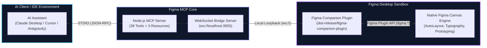

# Figma MCP — AI-Native UI/UX & Prototyping Engine

<p align="center">
  
  
  
  
  
</p>

<p align="center">
  An enterprise-grade <b>Model Context Protocol (MCP)</b> server and companion <b>Figma Desktop Plugin</b> that transforms AI assistants into autonomous UI/UX architects, design systems engineers, and interactive prototyping specialists.
</p>

---

## ⚡ The Challenge & The Solution

Traditional AI design tools produce "Dribbble-grade slop"—glossy, unvalidated happy-path screenshots that fail in real product engineering. Figma MCP was built from the ground up to solve the core architectural and usability gaps in AI-generated design:

| Challenge | Traditional AI & Cloud API Limitation | The Figma MCP Solution |
| :--- | :--- | :--- |
| **1. The "Read-Only" API Barrier** | Figma's cloud REST API is strictly **read-only** for canvas graphics. It cannot create frames, render vectors, configure AutoLayout, or wire prototypes on an active canvas. | **Dual-Transport Bidirectional Bridge**<br>Pairs STDIO JSON-RPC with a local loopback WebSocket (`ws://localhost:3055`) to a desktop plugin with 100% write access to the native `figma.*` engine. |
| **2. Multi-Roundtrip Latency Explosion** | Generating a single screen via primitive calls (`create_frame` $\rightarrow$ `create_rectangle`...) requires 100+ roundtrips, exhausting context windows and causing timeout crashes. | **Declarative Atomic Tree (`generate_ui_tree`)**<br>Compiles an entire nested screen hierarchy with AutoLayout, typography, colors, and semantic tags in a single payload in $< 200\text{ms}$. |
| **3. "AI Slop" & HCI Deficiency** | LLMs produce amateur visual outputs: buttons littered with emojis, uncalibrated leading that clips text, arbitrary spacing (`13px`, `27px`), and tiny inaccessible touch targets ($< 44\text{px}$). | **Enterprise Design Guardian & HCI Engine**<br>Automated zero-emoji sanitizer, 8pt spatial grid snapping, intelligent proportional typography leading/tracking, and Apple HIG 44px minimum touch target enforcement. |
| **4. State Incompleteness & First-Run Blindness** | Generative AI suffers from "state blindness"—producing exclusively static, populated mockups under ideal conditions. In real-world software, over half of the user lifecycle is spent in non-ideal states (zero-data onboarding, high-latency loading, network faults, and sparse datasets). Neglecting these lifecycle states leaves designs brittle, forces engineering teams to improvise fallback UI in production, and drives high first-run user churn. | **The "5 States of UI" Engine (`generate_state_matrix`)**<br>Instantly generates Ideal, Empty Onboarding, Loading Skeleton Shimmer, Empathetic Error with 1-click retry, and Partial/Boundary stress-test states. |
| **5. Dead-End Journeys & Missing Affordances** | AI outputs isolated, static screens that trap users without back affordances, lacks tactile interactive states (Hover, Pressed, Focus Rings), and uses vague CTAs (*"Submit"*). | **Cognitive Psychology & Journey Validator**<br>Scores screens against Hick's, Fitts's, Miller's, and Jakob's laws (`audit_ux_heuristics`), detects dead ends (`validate_user_journey`), and generates accessible focus rings (`generate_interactive_variants`). |

---

## 🏗️ Architecture



1. **MCP Server (`packages/mcp-server`)**: Communicates over standard `STDIO` with LLM clients, exposing **39 specialized design and UX tools**, while hosting a dual-stack local loopback WebSocket server on port `3055`.
2. **Figma Companion Plugin (`packages/figma-plugin`)**: Sandboxed plugin running inside Figma Desktop. Connects to the local bridge and directly executes native `figma.*` canvas operations, font loading, AutoLayout hierarchy, and prototype interaction noodles.

---

## ⚡ 60-Second Quickstart

### Step 1: Load Companion Plugin in Figma Desktop
1. Download or extract **[`dist-release/figma-companion-plugin.zip`](./dist-release/figma-companion-plugin.zip)** (17 KB standalone bundle).
2. In Figma Desktop, open any design file $\rightarrow$ right-click canvas $\rightarrow$ **Plugins** $\rightarrow$ **Development** $\rightarrow$ **"Import plugin from manifest..."**.
3. Select `manifest.json` from the extracted folder.
4. Press `Ctrl + Alt + P` (Windows) or `Cmd + Opt + P` (Mac) to run the plugin.

### Step 2: Connect Your AI Assistant

#### Claude Desktop
Add to your `claude_desktop_config.json`:
```json
{
  "mcpServers": {
    "figma": {
      "command": "npx",
      "args": ["-y", "figma-mcp"]
    }
  }
}
```

#### Cursor IDE
Add to `.cursor/mcp.json`:
```json
{
  "mcpServers": {
    "figma": {
      "command": "npx",
      "args": ["-y", "figma-mcp"]
    }
  }
}
```

#### Antigravity / Gemini / Custom MCP Client
* **Command:** `npx -y figma-mcp`
* **Transport:** `STDIO`

---

## 🛠️ Complete Toolset Reference (39 Tools)

### 🧠 1. UX Intelligence & Cognitive Architecture
* **`generate_state_matrix`**: Generates the **5 Essential States of UI** (*Ideal, Empty Onboarding, Loading Skeleton Shimmer, Empathetic Error with 1-click retry, and Partial/Boundary Stress Test*) organized neatly inside a labeled Section or Component Set.
* **`audit_ux_heuristics`**: Scores screens against empirical cognitive psychology:
  * **Hick’s Law:** Calculates decision latency ($T = b \log_2(n+1)$) and flags choice overload ($> 7\pm2$ choices) or competing primary CTAs.
  * **Fitts’s Law:** Checks touch ergonomics ($< 44\text{px}$) and flags destructive buttons placed dangerously close ($< 60\text{px}$) to primary progression actions.
  * **Miller’s Law:** Flags unchunked walls of inputs/items exceeding working memory thresholds.
  * **Jakob’s Law:** Audits standard convention placement for navigation, search, and avatar controls.
* **`validate_user_journey`**: Traverses prototype interaction noodles across artboards to detect **orphan screens** (unlinked artboards), **dead-end screens** (trapped users without back or exit affordance), and **unprotected destructive actions** (lacking confirmation dialogs).
* **`generate_interactive_variants`**: Creates production-ready Figma Component Sets with **Default, Hover, Pressed, Focused (WCAG 2.4.7 accessible focus ring), and Disabled** states, pre-wired with `whileHover` and `whilePress` Smart Animate transitions.
* **`lint_ux_microcopy`**: Audits UX writing anti-patterns (Lorem Ipsum, ambiguous CTAs like *"Submit"*, robotic blaming errors like *"Invalid input"*), providing empathetic, high-converting copy recommendations.

### 🎨 2. Declarative Generation & Design Guardian
* **`generate_ui_tree`**: Generates full hierarchical screens with AutoLayout, typography, colors, and tagged interactive elements in a single atomic call:
  * **Presets**: `iPhone 16`, `iPhone 16 Pro Max`, `Android`, `Desktop`, `Tablet`.
  * **Elements**: `frame`, `card`, `button`, `text`, `divider`, `spacer`.
  * **Tag Registry**: Assigns semantic tags (e.g. `tag: "signup_btn"`) and returns a map of `{ [tag]: nodeId }` for instant prototyping.
* **`lint_design_compliance`**: Automated HCI & visual design auditor checking 44px touch targets, 8pt grid consistency, calibrated leading, and zero emojis.
* **Zero-Emoji Enforcement**: Automatically sanitizes emojis from all text operations, preventing cartoonish outputs and routing to vector SVG paths.
* **Intelligent Typography**: Calibrates leading ($1.15\times - 1.5\times$ font size) and proportional tracking based on font size and weight.
* **8pt Spatial Grid**: Automatic snapping of margins, paddings, and gap dimensions.
* **Touch Target Enforcer**: Guarantees a minimum $44\times44\text{px}$ bounding box for interactive elements (Apple HIG & Google Material compliance).

### ⚡ 3. Interactive Prototyping & Flow Engine
* **`set_prototype_interaction`**: Wires interactive transitions between elements:
  * **Triggers**: `ON_CLICK`, `ON_HOVER`, `ON_PRESS`, `AFTER_TIMEOUT`.
  * **Navigations**: `NAVIGATE`, `OVERLAY`, `SWAP`, `BACK`, `CLOSE`.
  * **Transitions**: `SMART_ANIMATE`, `DISSOLVE`, `SLIDE_IN`, `MOVE_IN`, `INSTANT`.
* **`set_flow_starting_point`**: Sets named prototype flow starting points (e.g. *"Onboarding Flow"*).
* **`get_prototype_connections`**: Audits all flow starting points and prototype connection noodles on the page.
* **`batch_link_prototype`**: Wires multiple screen transitions across a user journey in one call.
* **`set_overlay_interaction`**: Configures modal dialogs, slide-over panels, and dropdown overlays with customizable backdrops, animations, and click-outside dismissal rules.

### 📐 4. Canvas Primitives, Components & Polish
* **`create_frame`**: Creates container frames or artboards.
* **`create_rectangle`**: Creates shapes, cards, or placeholders.
* **`create_ellipse`**: Creates circular/elliptical shapes (avatars, badges, status dots).
* **`create_svg_icon`**: Renders and inserts scalable SVG vector graphics with automatic color tinting.
* **`create_component`**: Creates master design system components.
* **`create_component_instance`**: Instantiates linked component instances from any master component ID.
* **`set_effects`**: Applies elevation shadows, inner shadows, layer blurs, and background blurs (`DROP_SHADOW`, `INNER_SHADOW`, `LAYER_BLUR`, `BACKGROUND_BLUR`).
* **`create_section`**: Groups and categorizes artboards and user journey paths into organized, labeled Figma Sections.
* **`focus_viewport`**: Pans and zooms the canvas viewport directly to specified nodes, with optional selection.
* **`create_text`**: Inserts typography with automatic font preloading (`Inter`, `Roboto`, etc.).
* **`set_autolayout`**: Applies Flexbox/AutoLayout (direction, gap, padding, axis alignments).
* **`update_node`**: Modifies position, dimensions, fills, corner radius, opacity, or visibility.
* **`delete_nodes`**: Deletes one or more nodes by ID.
* **`duplicate_node`**: Clones frames or elements with offsets (ideal for prototype state variants).
* **`set_stroke`**: Configures border colors, thicknesses, and alignments.
* **`set_text_content`**: Updates text copy while preserving typography styles.
* **`find_nodes`**: Searches canvas by keyword or node type.
* **`manage_page`**: Creates or switches active pages.
* **`get_document_tokens`**: Extracts local color paint styles, text typography styles, and effect styles directly from the document.
* **`export_node_image`**: Exports 2x Retina PNG snapshots as base64 for visual verification.

### 🔍 5. Canvas Diagnostics & Semantic Inspection
* **`get_figma_status`**: Checks whether the Figma Desktop companion plugin is connected.
* **`ping_figma`**: Tests round-trip WebSocket latency and document verification.
* **`get_document_info`**: Retrieves document name, pages list, active page, and selection count.
* **`get_design_context`**: Extracts a token-efficient semantic design outline of the page (artboards, buttons, cards, inputs, and prototype starting points) without vector noise.
* **`inspect_node`**: Recursively inspects any node by ID with strict depth capping (max 4) to protect LLM context windows.
* **`get_selection`**: Inspects details of elements currently highlighted on the canvas.

### ☁️ 6. Figma Cloud REST Tools (Headless Access)
*Optional: Requires `FIGMA_ACCESS_TOKEN` for cloud inspection without the desktop app:*
* **`rest_get_file`**: Read full file metadata, version history, components, and document tree from Figma Cloud.
* **`rest_get_file_nodes`**: Fetch specific node hierarchies by ID from the cloud.
* **`rest_get_images`**: Render high-resolution PNG, SVG, JPG, or PDF exports of frames via Figma's cloud render engine.
* **`rest_get_comments`**: Read collaboration comment threads, reviews, and pin coordinates.
* **`rest_post_comment`**: Post review feedback directly to a Figma screen pin via REST API.
* **`rest_get_variables`**: Read Figma Enterprise / Organization Variables (color themes, spacing scales, modes).
* **`rest_get_components`**: List published component library definitions and documentation links.

---

## 📦 MCP Resources & Prompts

### Resources (URI-Addressable Design State)
* **`figma://document/summary`**: Document outline, active pages, and selected canvas elements.
* **`figma://tokens/active`**: Complete design token registry (colors, typography styles, effect styles).
* **`figma://prototype/flows`**: Interactive connection graph and flow starting points on the page.

### High-Level Prompts (Guided Autonomous Workflows)
* **`architect_ux_experience`**: Guides the AI to conduct a comprehensive UX architectural review, generate the 5 UI states, audit cognitive heuristics, and validate user journey flow continuity.
* **`design_product_flow`**: Guided workflow taking a product concept, generating screens with AutoLayout, registering tags, and wiring interactive animations.
* **`wire_interactive_prototype`**: Guides the agent through discovering interactive targets and establishing seamless user journeys.
* **`audit_ux_design`**: Executes an accessibility, touch target ($\ge 44\text{px}$), spacing consistency, and visual hierarchy audit.

---

## 🛠️ Local Monorepo Development

```bash
# 1. Install dependencies
npm install

# 2. Build monorepo workspaces
npm run build

# 3. Clean port 3055 if locked by an orphaned background process
npm run clean:port

# 4. Package standalone plugin & zip
npm run package

# 5. Run server in development watch mode
npm run dev:server
```

---

## 🌐 Dual Transport & Cloud Deployment

### 1. Local Mode (Default STDIO)
Used by Claude Desktop, Cursor, and Antigravity:
```bash
node packages/mcp-server/dist/index.js
```

### 2. Remote Mode (Streamable HTTP / SSE)
Run as a cloud service or team gateway on port `3000`:
```bash
node packages/mcp-server/dist/index.js --transport=sse
# or with environment variables:
MCP_TRANSPORT=sse PORT=3000 node packages/mcp-server/dist/index.js
```

Endpoints provided:
* **`GET /health`**: Health check, uptime, bridge status, and REST config.
* **`GET /sse`**: SSE connection stream.
* **`POST /messages?sessionId=...`**: JSON-RPC message ingress.

### 3. Docker Container Deployment
Run with Docker Compose:
```bash
docker compose up -d --build
curl http://localhost:3000/health
```

---

## 📄 License

MIT © [Chimbueze David](https://github.com/ChimbuezeDavid)
